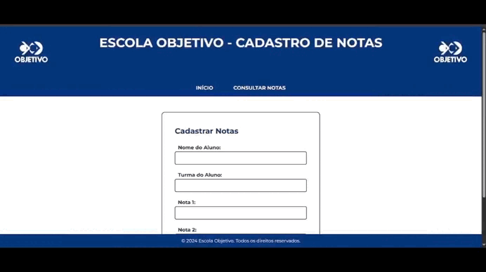

Site Objetivo
------------------------------

📌 Visão Geral
---------
Site institucional criado para apresentar de forma clara os serviços, missão, valores e informações de contato da plataforma. Design moderno, navegação intuitiva e totalmente responsivo.

🛠 Tecnologias Utilizadas
------
Front-end: HTML5, CSS3, JavaScript

Back-end: (substitua conforme o stack usado — exemplo: Flask, Django, PHP, Node.js)

Banco de Dados: (substitua conforme aplicável — SQLite, MySQL, etc.)

Ferramentas: Git, Responsive Design, APIs de integração (WhatsApp, redes sociais, etc.)
------
✨ Recursos Principais
Design Responsivo – Compatível com celulares, tablets e desktop

Seções Informativas – Missão, valores e serviços apresentados com clareza

Formulário de Contato – Comunicação direta com visitantes e potenciais clientes

Integração com Redes Sociais – Facilitando o acesso ao Insta, WhatsApp ou outras plataformas

Contato Claro – Informações de contato evidentes para conversão rápida

---

## 📽 Demonstração
<p align="center">
  
</p>

<p align="center">
  <video src="video/site-objetivo.mp4" autoplay muted playsinline width="100%">
    Seu navegador não suporta a tag de vídeo HTML5.
  </video>
</p>

---

## 🔗 Link da Aplicação 

Acesse o site online agora mesmo:

👉 https://site-objetivo.onrender.com

---

###  Estrutura de Arquivos (sugestão)
```text
site-objetivo/
├── index.html            # Página principal
├── styles.css            # Estilos e layout
├── script.js             # Interações e lógica (se aplicável)
├── imagens/              # Logos, banners, imagens visuais
├── video/                # GIFs e vídeos de demonstração
└── favicon.ico           # Ícone do site
